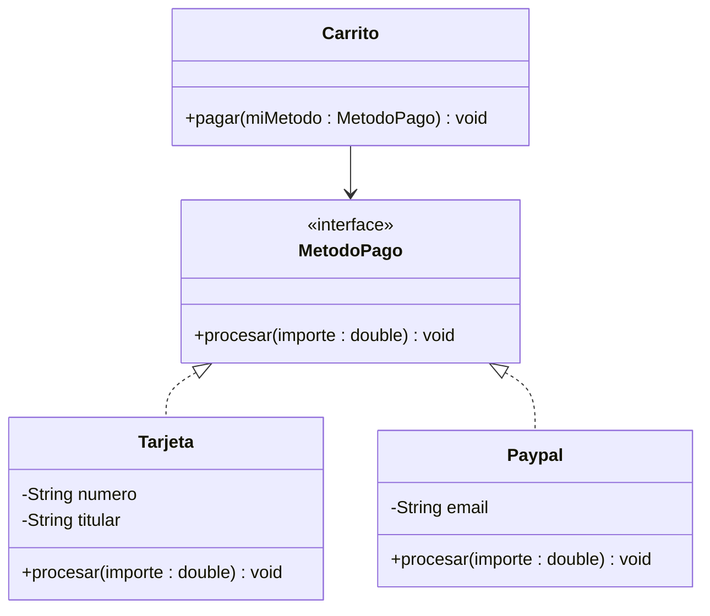

# 6.2.Bateria-de-ejercicios
UML CREADO 

```mermaid
classDiagram

class MetodoPago {
    <<interface>>
    +procesar(importe : double) void
}

class Tarjeta {
    -String numero
    -String titular
    +procesar(importe : double) void
}

class Paypal {
    -String email
    +procesar(importe : double) void
}

class Carrito {
    +pagar(miMetodo : MetodoPago) void
}

MetodoPago <|.. Tarjeta
MetodoPago <|.. Paypal
Carrito --> MetodoPago
```
