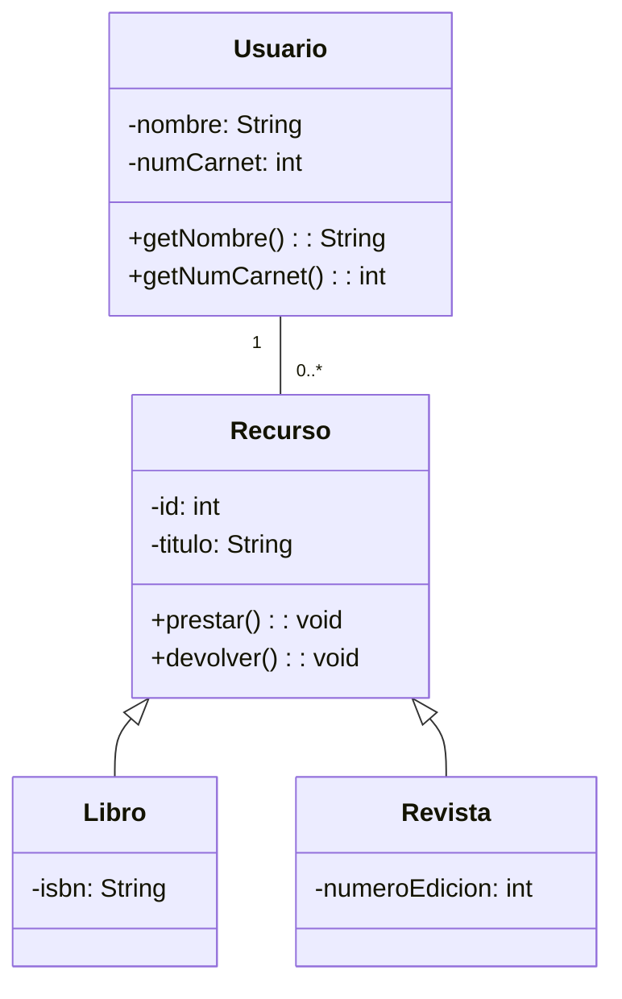

UML del Ejercicio 6

```mermaid
classDiagram
    class Recurso {
        -id: int
        -titulo: String
        +prestar(): void
        +devolver(): void
    }
    
    class Libro {
        -isbn: String
    }
    
    class Revista {
        -numeroEdicion: int
    }
    
    class Usuario {
        -nombre: String
        -numCarnet: int
        +getNombre(): String
        +getNumCarnet(): int
    }
    
    Recurso <|-- Libro
    Recurso <|-- Revista
    Usuario "1" -- "0..*" Recurso
```
