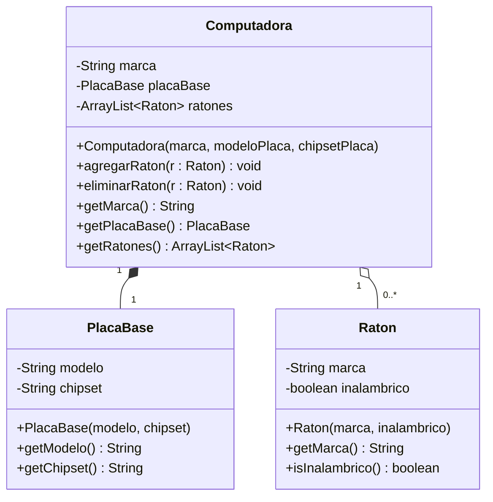

# 6.2.Bateria-de-ejercicios

```mermaid

classDiagram

class Computadora {
    -String marca
    -PlacaBase placaBase
    -ArrayList~Raton~ ratones
    +Computadora(marca, modeloPlaca, chipsetPlaca)
    +agregarRaton(r : Raton) void
    +eliminarRaton(r : Raton) void
    +getMarca() String
    +getPlacaBase() PlacaBase
    +getRatones() ArrayList~Raton~
}

class PlacaBase {
    -String modelo
    -String chipset
    +PlacaBase(modelo, chipset)
    +getModelo() String
    +getChipset() String
}

class Raton {
    -String marca
    -boolean inalambrico
    +Raton(marca, inalambrico)
    +getMarca() String
    +isInalambrico() boolean
}

Computadora "1" *-- "1" PlacaBase
Computadora "1" o-- "0..*" Raton

```
