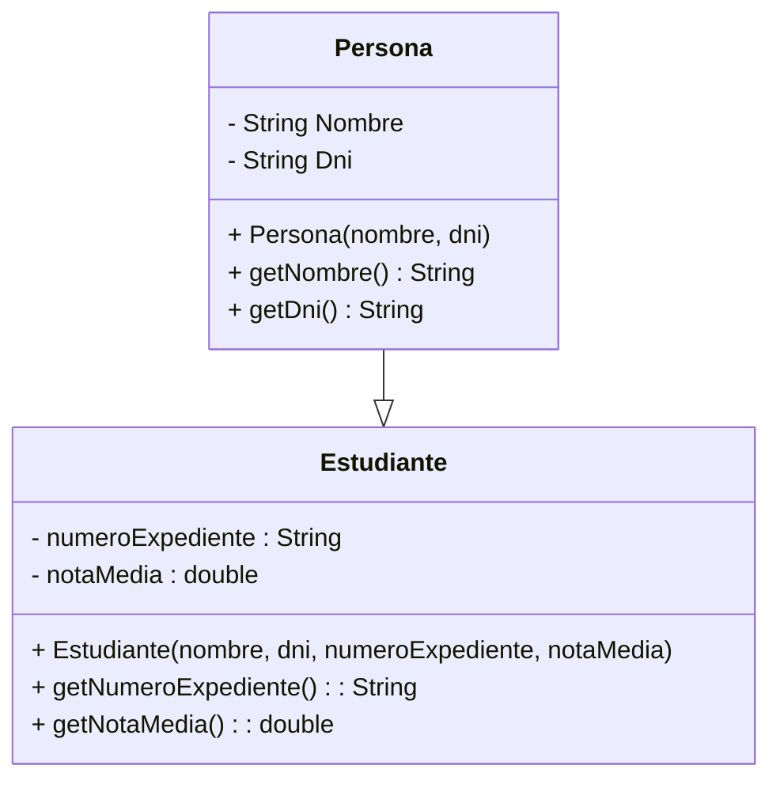

UML CREADO

```mermaid
classDiagram
direction TB
    class Persona {
	    - String Nombre
	    - String Dni
        + Persona(nombre, dni)
        + getNombre()  String
        + getDni()  String     
    }
   
    class Estudiante {
	    - numeroExpediente : String  
        - notaMedia : double
        + Estudiante(nombre, dni, numeroExpediente, notaMedia)
        + getNumeroExpediente() : String
        + getNotaMedia() : double

    }    
     Persona --|> Estudiante
```
